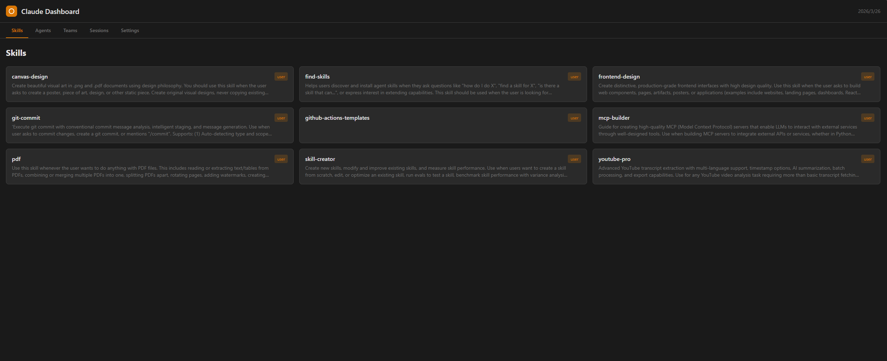

# Claude Dashboard

一个用于查看和管理 Claude Code 配置的精美 Web 仪表盘。



## 功能特性

- **Skills 管理** - 查看所有可用的技能（用户定义和插件）
- **Agents 总览** - 浏览内置和自定义 Agent 的详细配置
- **Teams 监控** - 实时追踪团队任务和 Agent 活动
- **Sessions 历史** - 查看对话历史，支持展开消息详情
- **设置查看** - 检查 Claude Code 设置和环境配置

## 安装

```bash
# 克隆仓库
git clone https://github.com/HAxiaoyu/claude-dashboard.git

# 进入目录
cd claude-dashboard

# 安装依赖
npm install

# 构建项目
npm run build
```

## 使用方法

安装完成后，可以直接在 Claude Code 中运行：

```
/claude-dashboard
```

这将自动启动仪表盘服务器并在浏览器中打开。

或者手动启动：

```bash
npm run server
```

仪表盘将在 `http://localhost:3000` 启动。

## 技术栈

- **前端**: Vue 3 + TypeScript + TailwindCSS
- **后端**: Express.js
- **构建工具**: Vite

## 快速开始

```bash
# 安装依赖
npm install

# 构建项目
npm run build

# 启动服务器
npm run server
```

仪表盘将在 `http://localhost:3000` 启动。

## 项目结构

```
claude-dashboard/
├── src/
│   ├── components/      # Vue 组件
│   ├── views/           # 页面视图
│   ├── server/          # Express 后端
│   │   └── routes/      # API 端点
│   ├── types/           # TypeScript 类型定义
│   └── style.css        # TailwindCSS 样式
├── skill.md             # 技能注册文件
└── package.json
```

## API 接口

| 接口 | 描述 |
|------|------|
| `GET /api/skills` | 获取所有技能列表 |
| `GET /api/skills/:name` | 获取技能详情 |
| `GET /api/agents` | 获取所有 Agent（内置 + 项目 + 用户） |
| `GET /api/agents/:id` | 获取 Agent 详情 |
| `GET /api/teams` | 获取所有团队 |
| `GET /api/teams/:name` | 获取团队详情 |
| `GET /api/sessions` | 获取活跃会话 |
| `GET /api/sessions/history` | 获取命令历史 |
| `GET /api/sessions/:id/conversation` | 获取完整对话内容 |
| `GET /api/settings` | 获取 Claude Code 设置 |

## 配置说明

仪表盘从以下位置读取配置：

- **用户级**: `~/.claude/` 目录
- **项目级**: 项目中的 `.claude/` 目录

### 自定义 Agent

在 `~/.claude/agents/` 或 `.claude/agents/` 创建自定义 Agent：

```
.claude/agents/
├── my-agent.md          # 单文件格式
└── another-agent/
    └── AGENT.md         # 目录格式
```

Agent 文件格式：

```yaml
---
name: 我的自定义 Agent
description: Agent 描述
model: sonnet
tools:
  - Read
  - Edit
  - Bash
---

Agent 指令内容...
```

### 自定义 Skills

Skills 自动从以下位置发现：

- `~/.claude/skills/`（用户级）
- `.claude/skills/`（项目级）
- 插件目录

## 开发

```bash
# 开发模式（热重载）
npm run dev

# 类型检查
npm run build

# 仅启动服务器
npm run server
```

## 许可证

[MIT](LICENSE)